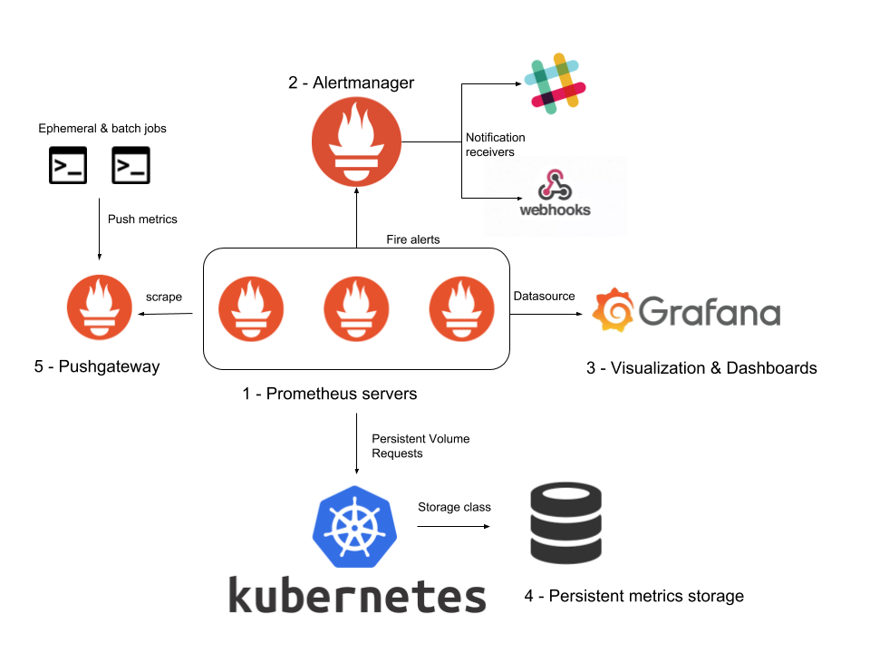

<h1 align="center">Grafana Operator</h1>

### Overview:

A Kubernetes Operator based on the Operator SDK for creating and managing Grafana instances.
Grafana is an open platform for beautiful analytics and monitoring.
Grafana is a database analysis and monitoring tool. Grafana is an open platform for beautiful analytics and monitoring. It allows you to create dashboard visualizations of key metrics.Grafana supports a huge number of data sources.The most common use case of Grafana is displaying time series data such as memory or CPU over time, alongside the current usage data.
Grafana runs as a process on your computer or server, and you access the interface through your browser. Your dashboard can display your data as single numbers, graphs, charts.

### Operator's features are as follows:

The Operator can deploy and manage a Grafana instance on Kubernetes and OpenShift. The following features are supported:

- Install Grafana to a namespace.
- Configure Grafana through the custom resource.
- Import Grafana dashboards from the same or other namespaces.
- Import Grafana data sources from the same namespace.
- Install Plugins (panels).

### Grafana Operator Architecture
A high level Prometheus & Grafana Architecture diagram is shown below :

### Objective of tutorial

In this tutorial,we are going to cover following topics:

1. Install Grafana Operator and verify its successful installation.
2. Create Grafana Instance and verify status of pods and services.
3. Monitoring a DB or any server using Prometheus and Grafana Operators.
4. How to access Grafana dashboard to visualize the different metrics.
5. Cleanup Operator.
